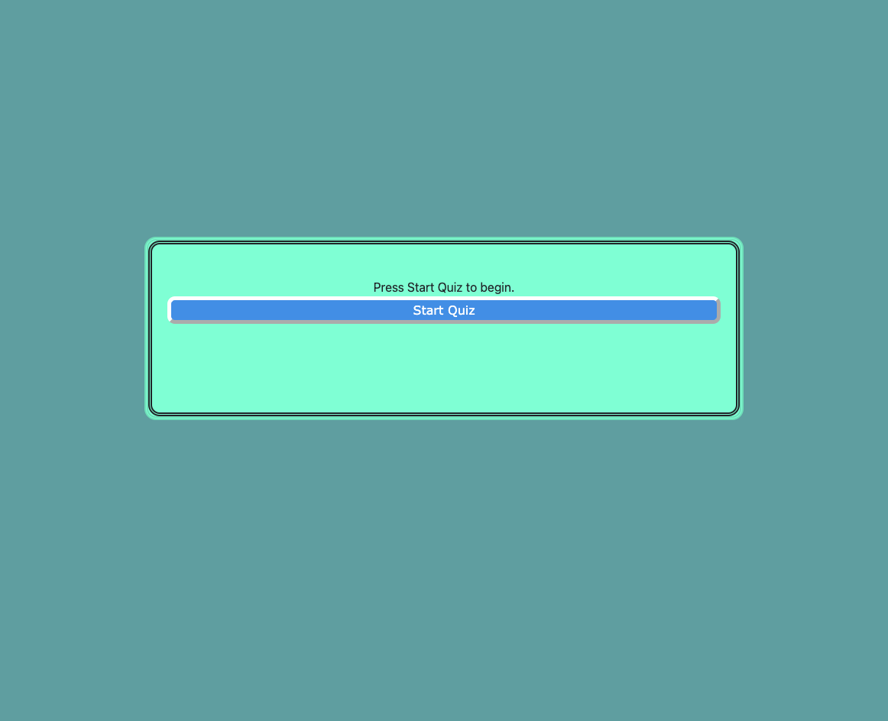

# Code Quiz

Deployed Link:
[https://sprantis.github.io/code-quiz/]

Description:
I have created my own JavaScript Fundamentals code quiz game that has a countdown feature. It tracks the player's name and high score using local storage and allows for multiple play throughs. Incorrect answers will deduct remaining time for the current play through.

Screenshot:

Repo Link:
[https://github.com/sprantis/code-quiz]
